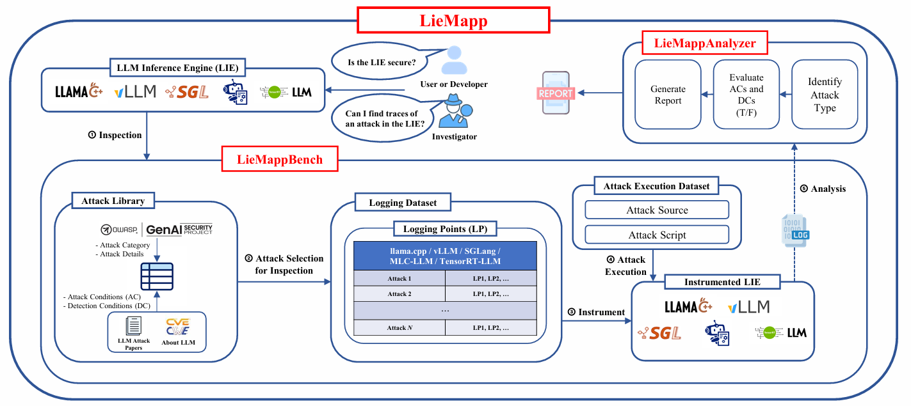

# Is Your LLM Inference Engine Already Exposed? Mapping Conditions to Source-Level Evidence

Developer : Minhyuk Jo  
Contact Mail : cgumgek8@korea.ac.kr  

## 1. Framework Overview



LieMapp은 LLM 추론 엔진의 소스 코드에서 공통 형식의 로그를 수집하고,
공격 전제 조건(AC)과 사후 관측 조건(DC)을 평가하는 프레임워크입니다.

개발자는 배포 전 진단에, 포렌식 수사관은 수집된 로그의 사후 분석에 활용합니다.

## 2. Usage

저장소 루트에서 실행합니다. `ATTACK_ID`와 `ENGINE_ID`는 `check.py --list`에 표시된 ID로 바꾸세요.

```bash
cd LieMapp

# 최초 공통 환경 설치 (이미 설치했다면 생략)
python3 -m venv .venv
python3 -m pip install -r requirements.txt

# 등록된 공격과 추론 엔진 확인
python3 check.py --list

# 개발자, 수사관: 새 실험·사고 재현 실행 후 로그 분석
python3 developer.py --attack ATTACK_ID --engine ENGINE_ID --execute --replace
python3 investigator.py --attack ATTACK_ID --engine ENGINE_ID --execute --replace

# 개발자, 수사관: 저장된 원시 로그 분석
python3 developer.py --attack ATTACK_ID --engine ENGINE_ID --replace
python3 investigator.py --attack ATTACK_ID --engine ENGINE_ID --replace
```

새 실험은 계측본과 실행 환경이 준비된 `can_execute: true` 엔진에서 가능합니다.
`--execute`를 빼면 저장된 로그만 분석합니다. `--replace`는 기존 결과를 백업한 뒤 교체합니다.

## 3. Log File

각 공격·엔진의 **조건마다 JSON 파일 1개**를 저장합니다.

```text
LieMappAnalyzer/LogFile/<attack>/<engine>/
  [Attack Name]-[Condition]-[Inference Engine Name]-LogFile.json
```

요약과 T/F → 조건 설명 → 실제 측정값·단위 → 소스 지점·로깅 이유 → 원본 근거 순서로 읽습니다.

## 4. Report

각 공격·엔진 조합의 **최종 보고서 MD 파일 1개**를 저장합니다.

```text
report/<attack>/<engine>/
  [Attack Name]-[Inference Engine Name]-Report.md
```

보고서에는 공격 종류, 추론 엔진, AC/DC의 T/F, 결론과 근거가 담깁니다.
먼저 보고서를 읽고, 세부 값이 궁금하면 해당 조건의 Log File을 확인하세요.

- **T**: 수집한 증거에서 조건 충족을 확인했습니다.
- **F**: 조건이 불충족이거나 증거가 부족합니다.

T/F는 조건에 대한 판정이며, 그 자체로 공격 성공이나 엔진의 안전을 보장하지 않습니다.
